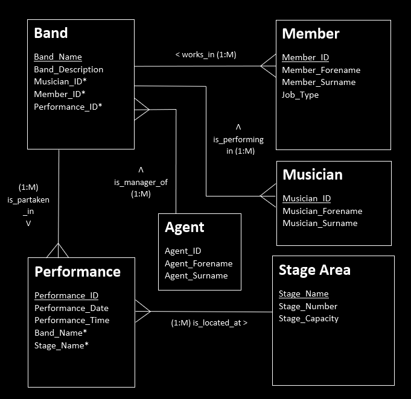

<!-- ABOUT THE PROJECT -->
## Blastonbury: SQL Database Project

Check out my [blog post](https://erolgelbul.com/project-blog/blastonbury-database) on the project

* Oracle 12i system via SQL Developer (a client which alows you to communicate with an Oracle Database).

(<a href="#top">back to top</a>)

<!-- Design -->
## Design

I was given information about a festival. The information follows:
* the schedule,
* agents,
* music bands,
* performance stages.
 
My job was to design a system where stakeholders would be able to view performances happening at a certain stage and which people were allowed
to enter depending on their role. Additionally, I was asked to query specific information they wanted me to collect from the database.

Some design notes:
* The line-up may be produced by printing out the attributes of the “Performance” entity.
* “Agent” entity is excluded from the “Band” entity for security reasons in the specification.
* “Optional/Mandatory Relationships” were not considered due to the example layout.
* Primary Keys are identified with underlined words, Foreign Keys are with “*”.
* M:M relationship between “Stage Area” and “Band” entities are resolved with adding a “Performance” link entity.

(<a href="#top">back to top</a>)

<!-- CONTACT -->
## Contact

Erol Gelbul - [Website](erolgelbul.com) - erolgelbul@gmail.com

Project Link: [Graphing Calculator](https://github.com/ErolGelbul/low_level_graph_calculator)

(<a href="#top">back to top</a>)

<!-- MARKDOWN LINKS & IMAGES -->
